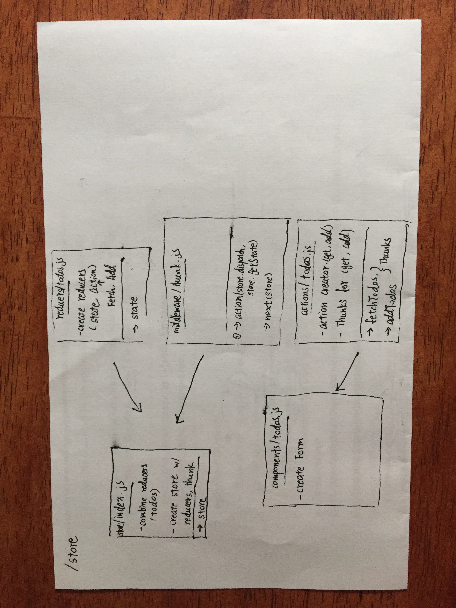

# Travel-buddy-server

## Express Routing and Connected API

### Author: Leyla Li

### Links and Resources
* [submission PR](https://github.com/401-advanced-javascript-leyla/travel-buddy-server)
* [travis]()

#### Documentation
* [jsdoc](localhost:8080/docs)

### Modules
#### `mongoose-model.js`
#### `user-schema.js`
#### `todo-schema.js`

### Setup
* `PORT` - 8080

#### Running the app
* `npm start`
* Endpoint: `/`
  * Returns a JSON object with destination data in it.

  
#### Tests
* `npm run test`

#### UML
